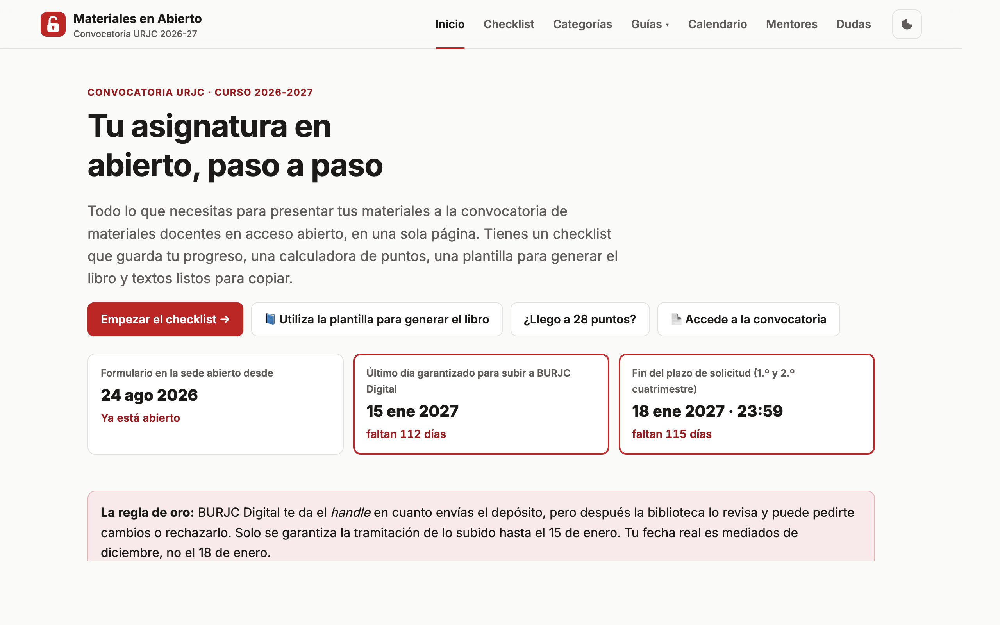
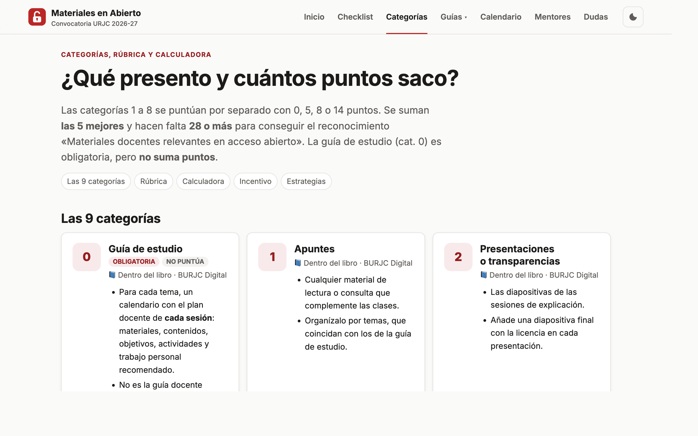
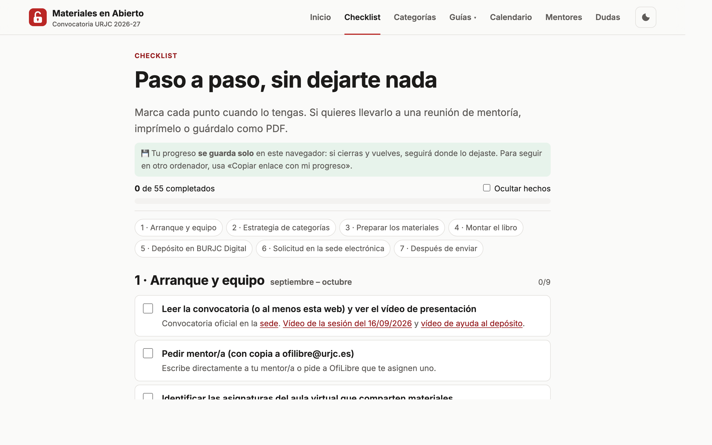
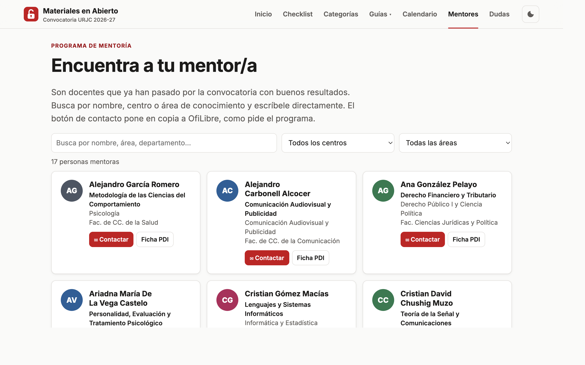

<div align="center">


# Materiales en Abierto · URJC 2026-27

**Guía práctica para preparar y presentar tus materiales docentes a la Convocatoria de reconocimiento de la publicación en acceso abierto de la Universidad Rey Juan Carlos.**

[](https://scaverod.github.io/materiales-abierto-urjc/)
&nbsp;
[](LICENSE)
&nbsp;
[](#desarrollo-local)

<br>



</div>

---

## ¿Qué es?

Una web estática que reúne en un solo sitio todo lo que hay que hacer en la convocatoria: qué presentar, cómo puntúa, cómo montar el único libro del depósito, cómo subir vídeos y código, y cuándo hacer cada cosa. Nació en el **programa de mentoría de Materiales Docentes en Abierto** de la URJC para acompañar al profesorado en la preparación de sus solicitudes.

> [!IMPORTANT]
> Es una guía **no oficial**. Si algo no coincide con el [texto oficial de la convocatoria](https://sede.urjc.es/tablon-oficial/anuncio/16116/), manda la convocatoria. Dudas oficiales: [ofilibre@urjc.es](mailto:ofilibre@urjc.es).

## Qué incluye

| | Sección | Para qué sirve |
|---|---|---|
| ✅ | [**Checklist**](https://scaverod.github.io/materiales-abierto-urjc/pasos.html) | 55 comprobaciones en 7 fases. Guarda el progreso en el navegador y permite compartirlo por enlace, exportarlo e imprimirlo. |
| 🧮 | [**Categorías y puntos**](https://scaverod.github.io/materiales-abierto-urjc/categorias.html) | Las 9 categorías, la rúbrica oficial y una calculadora de puntos (umbral de 28) y del incentivo estimado. |
| 📘 | [**El libro de la asignatura**](https://scaverod.github.io/materiales-abierto-urjc/libro.html) | Plantilla lista para Overleaf que genera el único PDF del depósito. No hace falta saber LaTeX. |
| 🎬 | [**Subir vídeos a TV URJC**](https://scaverod.github.io/materiales-abierto-urjc/tv-urjc.html) | Los 8 pasos desde el Aula Virtual y cómo añadir la portada a todos los vídeos con [Batch Video Intro Adder](https://github.com/scaverod/Batch-Video-Intro-Adder). |
| 💾 | [**Depositar el código**](https://scaverod.github.io/materiales-abierto-urjc/software.html) | De GitHub a Software Heritage y a BURJC Digital, evitando los motivos de exclusión habituales. |
| 📝 | [**Textos listos**](https://scaverod.github.io/materiales-abierto-urjc/textos.html) | Generador de la nota de copyright, los metadatos, el `datos.tex`, el Anexo V, la declaración de IA y los textos del formulario. |
| 🗓 | [**Calendario**](https://scaverod.github.io/materiales-abierto-urjc/calendario.html) | Plan de trabajo recomendado y exportación de las fechas límite a tu calendario (`.ics`). |
| 🤝 | [**Mentores**](https://scaverod.github.io/materiales-abierto-urjc/mentores.html) | Buscador por centro y área, con contacto directo y copia a OfiLibre. |
| ❓ | [**Dudas**](https://scaverod.github.io/materiales-abierto-urjc/faq.html) | Preguntas frecuentes con buscador y filtros, y todos los enlaces oficiales. |

<table>
  <tr>
    <td></td>
    <td></td>
    <td></td>
  </tr>
</table>

## Plantilla del libro

Desde 2026-27, todo el material bibliográfico va en **un único depósito** de BURJC Digital, cuyo elemento principal es **un único PDF organizado como un libro**. La plantilla de [`plantilla-libro-latex/`](plantilla-libro-latex) lo resuelve así:

- **Datos en un solo fichero.** En `datos.tex` pones el nombre temático, los autores, los grados y la licencia (CC BY o CC BY-SA). La web te lo genera.
- **Portada y créditos completos.** Incluyen los datos obligatorios del Anexo III y la declaración de IA del Anexo VI.
- **Un capítulo por categoría.** Cada PDF se incluye con una sola línea: `\material{Título}{ruta.pdf}{Descripción}`.
- **Compila aunque falten ficheros.** Donde falte un PDF muestra un aviso, así que puedes montarlo poco a poco.

Descárgala en [`descargas/plantilla-libro-latex.zip`](descargas/plantilla-libro-latex.zip), súbela a Overleaf y compila. También puedes ver [el PDF que genera](descargas/ejemplo-libro-plantilla.pdf).

## Estructura del repositorio

```
.
├── index.html, pasos.html, …     # Páginas de la web (una por sección)
├── assets/
│   ├── app.js                    # Cabecera, menú, pie, tema, copiar, cuentas atrás
│   ├── style.css                 # Estilos (modo claro/oscuro, responsive)
│   └── img/                      # Favicon y logos
├── plantilla-libro-latex/        # Fuente de la plantilla del libro
├── descargas/                    # ZIP de la plantilla, PDF de ejemplo, convocatoria y Anexo V
├── build.sh                      # Regenera descargas/ a partir de la plantilla
└── .github/screenshots/          # Capturas para este README
```

## Desarrollo local

No hay compilación ni dependencias. Basta un servidor estático:

```sh
python3 -m http.server 8000
# → http://localhost:8000
```

Si cambias la plantilla del libro, regenera las descargas (necesita `zip` y, de forma opcional, [`tectonic`](https://tectonic-typesetting.github.io/) para el PDF de ejemplo):

```sh
./build.sh
```

### Dónde tocar cada cosa

| Quiero cambiar… | Fichero |
|---|---|
| El menú, la cabecera o el pie | `assets/app.js` (array `NAV`) |
| Los puntos del checklist | `pasos.html` (array `PHASES`) |
| La lista de mentores | `mentores.html` (array `M`) |
| Las fechas del calendario y del `.ics` | `calendario.html` (array `EVENTS`) |
| Las cuentas atrás de la portada | `index.html` (atributos `data-countdown`) |

### Para la próxima convocatoria

1. Actualiza las fechas en `index.html` y `calendario.html` y los textos de novedades.
2. Revisa la rúbrica en `categorias.html` y los requisitos del libro en `libro.html`.
3. Cambia las claves de almacenamiento (`checklist-2027`, `calc-2027`, `textos-2027`) para que nadie arrastre el progreso del año anterior.
4. Sustituye `descargas/convocatoria-2026-2027.pdf` por la nueva convocatoria.

## Privacidad

La web no usa cookies, analítica ni servidor. El progreso del checklist, la calculadora y los datos del generador de textos se guardan solo en el `localStorage` de tu navegador y nunca salen de él.

## Contribuir

¿Has visto un error o algo que ha cambiado en la convocatoria? Abre un [issue](https://github.com/scaverod/materiales-abierto-urjc/issues) o un pull request. Las aportaciones de otros mentores son especialmente bienvenidas.

## Créditos y licencia

Desarrollado por [Sergio Cavero](https://servicios.urjc.es/pdi/ver/sergio.cavero) y ✳ Claudia.
La plantilla del libro parte del libro de *Estructuras de Datos* (S. Cavero Díaz y S. Sánchez Alonso).

El contenido y la plantilla se distribuyen bajo licencia [Creative Commons Atribución-CompartirIgual 4.0 Internacional](LICENSE).
La convocatoria y el Anexo V de `descargas/` son documentos oficiales públicos de la Universidad Rey Juan Carlos y se incluyen como copia de referencia. Los logotipos de la URJC y de OfiLibre pertenecen a sus titulares.
